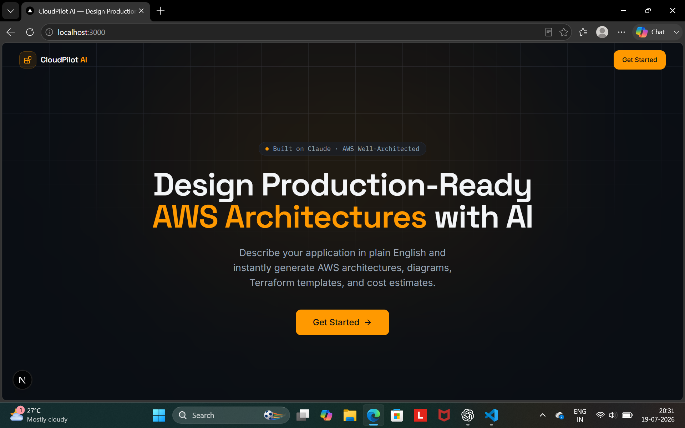
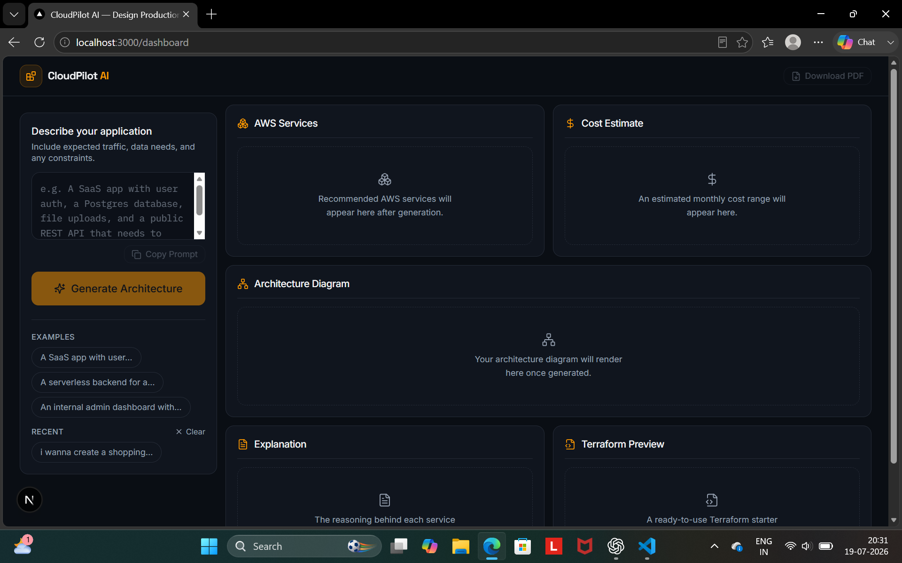
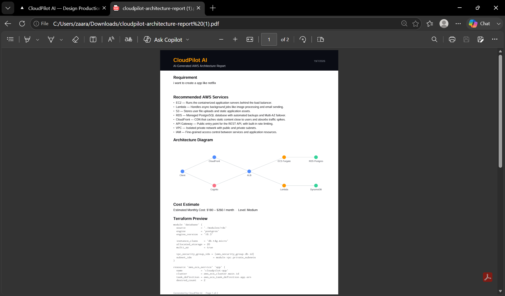

# ☁️ CloudPilot AI

An AI-powered AWS architecture assistant that converts application requirements into a recommended cloud architecture, estimated monthly cost, Terraform starter configuration, and downloadable PDF report.

---

## 🚀 Features

- AI-inspired AWS architecture recommendation
- Interactive architecture diagram
- AWS service recommendations
- Monthly cost estimation
- Terraform starter code preview
- Download architecture report as PDF
- Clean and responsive dashboard UI
- Professional dark theme

---

## 🛠 Tech Stack

| Category | Technology |
|----------|------------|
| Framework | Next.js 16 |
| Language | TypeScript |
| Styling | Tailwind CSS |
| UI | React |
| PDF Export | jsPDF |
| Icons | Lucide React |

---

## 📸 Screenshots

### Landing Page



---

### Dashboard



---

### Generated Architecture


---

### PDF Export



---

## 🏗 Project Architecture

```
User Requirement
        │
        ▼
Generate Architecture
        │
        ▼
──────────────────────────
AWS Services
Architecture Diagram
Cost Estimation
Terraform Preview
PDF Export
──────────────────────────
```

---

## ⚙️ Installation

Clone the repository

```bash
git clone https://github.com/ummezaara/cloudpilot-ai.git
```

Go inside the project

```bash
cd cloudpilot-ai
```

Install dependencies

```bash
npm install
```

Run locally

```bash
npm run dev
```

Open

```
http://localhost:3000
```

---

## 📂 Folder Structure

```
app/
components/
config/
lib/
public/
screenshots/
```

---

## 🎯 Future Improvements

- Claude/OpenAI API integration
- Live Mermaid architecture generation
- AWS pricing API integration
- Download Terraform project
- User authentication
- Architecture history
- Multi-cloud support

---

## 👩‍💻 Author

**Umme Zaara**

Final Year B.E. Artificial Intelligence & Machine Learning

Cloud & AI Enthusiast

GitHub:
https://github.com/ummezaara